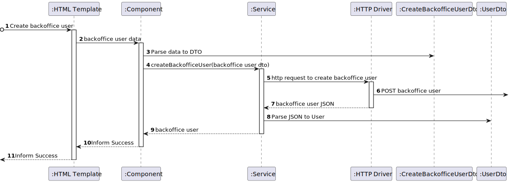

# US 10 - As an administrator, I want to create a system user, indicating their permissions.

## 1. Context
* This task comes in the context of Sprint C.
* This is the first time this task is being developed

## 2. Requirements

**US 10 -** As an administrator, I want to:
* create a system user, indicating their permissions.

### Client Clarifications


> **Question:** Em relação a este requisito, podemos presumir que já houve consentimento por parte do utilizador que vai ser registado?<br><br>
**Answer:** esta funcionalidade apenas permite criar utilizadores de tipo "não utente" para os funcionários da instituição pelo que a aplicação do RGPD e restantes questões de privacidade estão abrangidas pela relação laboral existente

> **Question:** No contexto da criação de utilizadores, desejo entender como posso identificar e distinguir um utilizador dos demais utilizadores.<br><br>
**Answer:** o email será o username que identifica cada utilizador

> **Question:** No desenvolvimento da US10 surgiu uma questão em relação à password do utilizador criado. Esta password deve ser gerada automaticamente? Se sim, que requisitos considera para uma password segura e como deve ser a password gerada?<br><br>
**Answer:** de momento a password inicial deve ser introduzida pelo administrador quando cria a conta. a politica de passwords é a seguinte:<br>
    - minimo 10 caracteres<br>
    - pelo menos 1 letra maiuscula<br>
    - pelo menos 1 letra minuscula<br>
    - pelo menos 1 digito<br>
    - pelo menos 1 simbolo<br>
 Nota: as funcionlidades de autenticação e autorização num sistema real serão bem mais complexas do que as abarcadas aqui no projeto em termos académicos. Neste âmbito pretende-se apenas um mecanismo básico de utilizadores e o principal foco está nas componentes relacionadas com os dados pessoais para os utilizaodres do tipo "utente" 

> **Question:** Como pretende que a atribuição de um Role seja feito?<br>
    1. Durante o registo do utente pelo Administrator (US10)<br>
    2. Durante o registo do utente pelo próprio utente (US20)<br>
    3. Durante a aprovação do registo do utente pelo Administrator (US80)<br><br>
**Answer:** o administrador atribui o papel na criação de utilizadores.
Os utilizadores que utilizem a funcionalidade de registo serão sempre do tipo "utente"

> **Question:** Que dados são necessários para a criação/registo de um utilizador, para além do seu Role?<br><br>
**Answer:** criação de utilizadores e registo de utilizadores são dois casos de uso diferentes e com necessidades distintas.<br><br>
a criação de utilizadores serve para os administradores de sistema criarem os diversos utilizadores de backoffice do sistema num dos papeis designados, ex., gestor de campus, gestor de frota, gestor de tarefas<br><br>
o registo de utentes serve para o registo de utilizadores com o papel utente <br><br>
em ambos os casos será necessário obter nome, email e telefone.<br><br>
no registo de utentes deve adicionalmente ser recolhido o número de contribuinte para faturação de serviços<br><br>
apenas serão aceites emails da organização, ex., isep.ipp.pt.<br><br>
NOTA: a parametrização do dominio de email aceite deve ser mantida fora do código fonte do projeto, ex., ficheiro de propriedades ou variavel de ambiente     

## 3. Analysis

**Regarding this requirement we understand that:**
As an Administrator, an actor of the system responsible for the management of the system, I will be able to create a backoffice user (with one of these roles: Campus Manager, Fleet Manager, Task Manager, Administrator), defining their name, phone number, email address and password.
- System Manager/Administrator: User role that has overall control of the RobDroneGo system. They are responsible for the maintenance and configuration of the system, ensuring that it is operating correctly and efficiently. They can manage user accounts, system settings, and have access to all data in the system.

- Campus Manager: User role that manages the data of the routes and maps.

- Fleet Manager: User role that manages the data of the robots and drones and the types of tasks.

- Task Manager: User role that manages the data of the tasks.

### 3.1. Domain Model Excerpt

## 4. Design

We will create auth module which will store information
about the system users, name, email, phone number and password.

This module will store that information in a relational
database.

### 4.1. Realization

### Level1

###### LogicalView:


###### SceneryView:


###### ProcessView:


#### Level2

###### LogicalView:


###### ImplementationView:


###### PhysicalView:


###### ProcessView:


#### Level3

###### LogicalView:


###### ImplementationView:


###### ProcessView (Visualization Module):



###### ProcessView (Auth Module):


### 4.2. Applied Patterns
* Controller
* Service
* Dto

### 4.3. Tests

#### UserController Unit Testing
```c#
    [TestMethod]
    public async Task Check_Invalid_Role_For_BackofficeUser_Creation()
    {
        Mock<IUserService> userService = new Mock<IUserService>();
        userService.Setup(x => x.CreateBackofficeUser(It.IsAny<CreateBackofficeUserDto>()))
            .ThrowsAsync(new BusinessRuleValidationException("Invalid role."));

        UserController userController = new UserController(userService.Object);

        string name = "Jose Gouveia";
        string email = "1211089isep.ipp.pt";
        string phoneNumber = "930597721";
        string password = "1211089aA!";
        string role = "Manager";

        CreateBackofficeUserDto dto = new CreateBackofficeUserDto(name, email, phoneNumber, password, role);
        var result = await userController.CreateBackofficeUser(dto);

        Assert.IsInstanceOfType(result.Result, typeof(BadRequestObjectResult));
    }

    [TestMethod]
    public async Task Check_Valid_Role_For_BackofficeUser_Creation()
    {
        string name = "Jose Gouveia";
        string email = "1211089@isep.ipp.pt";
        string phoneNumber = "930597721";
        string password = "1211089aA!";
        string role = "Admin";

        CreateBackofficeUserDto dto = new CreateBackofficeUserDto(name, email, phoneNumber, password, role);
        UserDto userDto = new UserDto(name, email, phoneNumber, "999999999", "Admin");

        Mock<IUserService> userService = new Mock<IUserService>();
        userService.Setup(x => x.CreateBackofficeUser(It.IsAny<CreateBackofficeUserDto>()))
            .ReturnsAsync(userDto);

        UserController userController = new UserController(userService.Object);

        var result = await userController.CreateBackofficeUser(dto);

        Assert.IsInstanceOfType(result.Result, typeof(OkObjectResult));
        Assert.AreEqual(userDto, ((OkObjectResult)result.Result).Value);
    }
```

#### UserService Unit Testing
```c#
    [TestMethod]
    public async Task Check_Valid_Role_For_BackofficeUser_Creation()
    {
        string name = "Jose Gouveia";
        string email = "1211089@isep.ipp.pt";
        string phoneNumber = "930597721";
        string password = "1211089aA!";
        string role = "Admin";

        CreateBackofficeUserDto dto = new CreateBackofficeUserDto(name, email, phoneNumber, password, role);
        _userRepository.Setup(x => x.AddAsync(It.IsAny<User>()));
        _unitOfWork.Setup(x => x.CommitAsync());

        var user = await _userService.CreateBackofficeUser(dto);

        Assert.AreEqual(name, user.Name);
        Assert.AreEqual(email, user.Email);
        Assert.AreEqual(phoneNumber, user.PhoneNumber);
        Assert.AreEqual("Admin", user.Role);
    }

    [TestMethod]
    public async Task Check_Invalid_Role_For_BackofficeUser_Creation()
    {
        string name = "Jose Gouveia";
        string email = "1211089@isep.ipp.pt";
        string phoneNumber = "930597721";
        string password = "1211089aA!";
        string role = "Manager";

        CreateBackofficeUserDto dto = new CreateBackofficeUserDto(name, email, phoneNumber, password, role);

        try
        {
            var user = await _userService.CreateBackofficeUser(dto);
        }
        catch (Exception e)
        {
            Assert.IsTrue(e is BusinessRuleValidationException);
        }
    }

```

#### UserService and UserController Integration Testing
```c#
    [TestMethod]
    public async Task Check_Invalid_Role_For_BackofficeUser_Creation()
    {
        Mock<IUserRepository> userRepository = new Mock<IUserRepository>();
        Mock<IUnitOfWork> unitOfWork = new Mock<IUnitOfWork>();
        Mock<ILogger<UserService>> logger = new Mock<ILogger<UserService>>();
        Mock<IConfiguration> configuration = new Mock<IConfiguration>();

        userRepository.Setup(x => x.AddAsync(It.IsAny<User>()));
        unitOfWork.Setup(x => x.CommitAsync());

        IUserService userService = new UserService(logger.Object, unitOfWork.Object, userRepository.Object, configuration.Object);

        UserController userController = new UserController(userService);

        string name = "Jose Gouveia";
        string email = "1211089isep.ipp.pt";
        string phoneNumber = "930597721";
        string password = "1211089aA!";
        string role = "Manager";

        CreateBackofficeUserDto dto = new CreateBackofficeUserDto(name, email, phoneNumber, password, role);
        var result = await userController.CreateBackofficeUser(dto);

        Assert.IsInstanceOfType(result.Result, typeof(BadRequestObjectResult));
    }

    [TestMethod]
    public async Task Check_Valid_Role_For_BackofficeUser_Creation()
    {
        Mock<IUserRepository> userRepository = new Mock<IUserRepository>();
        Mock<IUnitOfWork> unitOfWork = new Mock<IUnitOfWork>();
        Mock<ILogger<UserService>> logger = new Mock<ILogger<UserService>>();
        Mock<IConfiguration> configuration = new Mock<IConfiguration>();
        userRepository.Setup(x => x.AddAsync(It.IsAny<User>()));
        unitOfWork.Setup(x => x.CommitAsync());

        IUserService userService = new UserService(logger.Object, unitOfWork.Object, userRepository.Object, configuration.Object);
        UserController userController = new UserController(userService);

        string name = "Jose Gouveia";
        string email = "1211089@isep.ipp.pt";
        string phoneNumber = "930597721";
        string password = "1211089aA!";
        string role = "Admin";
        CreateBackofficeUserDto dto = new CreateBackofficeUserDto(name, email, phoneNumber, password, role);
        UserDto userDto = new UserDto(name, email, phoneNumber, "999999999", "Admin");

        var result = await userController.CreateBackofficeUser(dto);

        Assert.IsInstanceOfType(result.Result, typeof(OkObjectResult));
        Assert.AreEqual(((OkObjectResult)result.Result).Value.ToString(), userDto.ToString());
    }

```

## 5. Implementation
#### UserController
```c#
using Microsoft.AspNetCore.Mvc;
using RobDroneGoAuth.Dto.Users;
using RobDroneGoAuth.Services.Users;

namespace RobDroneGoAuth.Controllers.User
{
    [Route("api/users")]
    [ApiController]
    public class UserController : ControllerBase
    {
        private readonly IUserService _userService;
        public UserController(IUserService userService)
        {
            this._userService = userService;
        }

        (...)

        [HttpPost("backoffice")]
        public async Task<ActionResult<UserDto>> CreateBackofficeUser([FromBody] CreateBackofficeUserDto dto)
        {
            try
            {
                var user = await this._userService.CreateBackofficeUser(dto);
                return Ok(user);
            }
            catch (Exception e)
            {
                return BadRequest(e.Message);
            }
        }
    }
}

```

#### UserService
```c#
using System.IdentityModel.Tokens.Jwt;
using System.Security.Claims;
using System.Text;
using DDDSample1.Domain.Shared;
using Microsoft.IdentityModel.Tokens;
using RobDroneGoAuth.Domain.Users;
using RobDroneGoAuth.Dto.Users;

namespace RobDroneGoAuth.Services.Users
{
    public class UserService : IUserService
    {
        private readonly IUnitOfWork _unitOfWork;
        private readonly IUserRepository _userRepository;
        private readonly ILogger<UserService> _logger;
        private readonly IConfiguration _configuration;
        private readonly string _defaultRole = "Utente";

        public UserService(ILogger<UserService> logger, IUnitOfWork unitOfWork,
         IUserRepository userRepository, IConfiguration configuration)
        {
            this._logger = logger;
            this._unitOfWork = unitOfWork;
            this._userRepository = userRepository;
            this._configuration = configuration;
        }

        (...)

        public async Task<UserDto> CreateBackofficeUser(CreateBackofficeUserDto dto)
        {
            try
            {
                _logger.LogInformation("UserService: Creating backoffice user\n\n");

                var email = Email.Create(dto.Email);
                var userInDb = await this._userRepository.GetByIdAsync(email);
                if (userInDb != null)
                {
                    throw new BusinessRuleValidationException("Email already in use");
                }

                var user = User.Create(dto.Name, dto.Email, "999999999", dto.PhoneNumber, dto.Password, dto.Role);
                await this._userRepository.AddAsync(user);
                await this._unitOfWork.CommitAsync();
                return new UserDto(user.Name.NameString, user.Id.Value, user.PhoneNumber.Number, user.TaxPayerNumber.Number, user.Role.Value);
            }
            catch (BusinessRuleValidationException e)
            {
                _logger.LogWarning("UserService: Error has occurred while creating backoffice user: " + e.Message + "\n\n");
                throw new BusinessRuleValidationException(e.Message);
            }
            catch (Exception e)
            {
                _logger.LogError("UserService: Error has occurred while creating backoffice user: " + e.Message + "\n\n");
                throw new Exception(e.Message);
            }
        }
    }
}

```

## 6. Integration/Demonstration
To use this functionality it is necessary to be logged in with an Admin account in the web app. Then go to the Backoffice Users menu and fill the form with the requested parameters: Name, Email, Phone Number, Password and Role. Then click create and an http POST request will be sent to the Auth module to create the requested backoffice user.
## 7. Observations

No additional observations.
