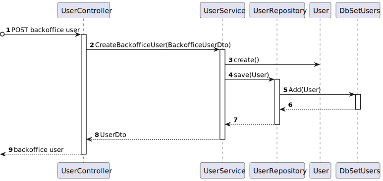

# US 10 - As an administrator, I want to create a system user, indicating their permissions.

## 1. Context
* This task comes in the context of Sprint C.
* This is the first time this task is being developed

## 2. Requirements

**US 10 -** As an administrator, I want to:
* create a system user, indicating their permissions.

### Client Clarifications


> **Question:** Em relação a este requisito, podemos presumir que já houve consentimento por parte do utilizador que vai ser registado?<br><br>
**Answer:** esta funcionalidade apenas permite criar utilizadores de tipo "não utente" para os funcionários da instituição pelo que a aplicação do RGPD e restantes questões de privacidade estão abrangidas pela relação laboral existente

> **Question:** No contexto da criação de utilizadores, desejo entender como posso identificar e distinguir um utilizador dos demais utilizadores.<br><br>
**Answer:** o email será o username que identifica cada utilizador

> **Question:** No desenvolvimento da US10 surgiu uma questão em relação à password do utilizador criado. Esta password deve ser gerada automaticamente? Se sim, que requisitos considera para uma password segura e como deve ser a password gerada?<br><br>
**Answer:** de momento a password inicial deve ser introduzida pelo administrador quando cria a conta. a politica de passwords é a seguinte:<br>
    - minimo 10 caracteres<br>
    - pelo menos 1 letra maiuscula<br>
    - pelo menos 1 letra minuscula<br>
    - pelo menos 1 digito<br>
    - pelo menos 1 simbolo<br>
 Nota: as funcionlidades de autenticação e autorização num sistema real serão bem mais complexas do que as abarcadas aqui no projeto em termos académicos. Neste âmbito pretende-se apenas um mecanismo básico de utilizadores e o principal foco está nas componentes relacionadas com os dados pessoais para os utilizaodres do tipo "utente" 

> **Question:** Como pretende que a atribuição de um Role seja feito?<br>
    1. Durante o registo do utente pelo Administrator (US10)<br>
    2. Durante o registo do utente pelo próprio utente (US20)<br>
    3. Durante a aprovação do registo do utente pelo Administrator (US80)<br><br>
**Answer:** o administrador atribui o papel na criação de utilizadores.
Os utilizadores que utilizem a funcionalidade de registo serão sempre do tipo "utente"

> **Question:** Que dados são necessários para a criação/registo de um utilizador, para além do seu Role?<br><br>
**Answer:** criação de utilizadores e registo de utilizadores são dois casos de uso diferentes e com necessidades distintas.<br><br>
a criação de utilizadores serve para os administradores de sistema criarem os diversos utilizadores de backoffice do sistema num dos papeis designados, ex., gestor de campus, gestor de frota, gestor de tarefas<br><br>
o registo de utentes serve para o registo de utilizadores com o papel utente <br><br>
em ambos os casos será necessário obter nome, email e telefone.<br><br>
no registo de utentes deve adicionalmente ser recolhido o número de contribuinte para faturação de serviços<br><br>
apenas serão aceites emails da organização, ex., isep.ipp.pt.<br><br>
NOTA: a parametrização do dominio de email aceite deve ser mantida fora do código fonte do projeto, ex., ficheiro de propriedades ou variavel de ambiente     

## 3. Analysis

**Regarding this requirement we understand that:**
As an Administrator, an actor of the system responsible for the management of the system, I will be able to create a backoffice user (with one of these roles: Campus Manager, Fleet Manager, Task Manager, Administrator), defining their name, phone number, email address and password.
- System Manager/Administrator: User role that has overall control of the RobDroneGo system. They are responsible for the maintenance and configuration of the system, ensuring that it is operating correctly and efficiently. They can manage user accounts, system settings, and have access to all data in the system.

- Campus Manager: User role that manages the data of the routes and maps.

- Fleet Manager: User role that manages the data of the robots and drones and the types of tasks.

- Task Manager: User role that manages the data of the tasks.

### 3.1. Domain Model Excerpt

## 4. Design

We will create auth module which will store information
about the system users, name, email, phone number and password.

This module will store that information in a relational
database.

### 4.1. Realization

### Level1

###### LogicalView:


###### SceneryView:


###### ProcessView:


#### Level2

###### LogicalView:


###### ImplementationView:


###### PhysicalView:


###### ProcessView:


#### Level3

###### LogicalView:


###### ImplementationView:


###### ProcessView:




### 4.2. Applied Patterns


### 4.3. Tests

```ts

```


## 5. Implementation

## 6. Integration/Demonstration

## 7. Observations

No additional observations.
