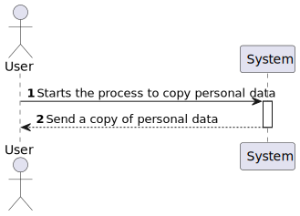
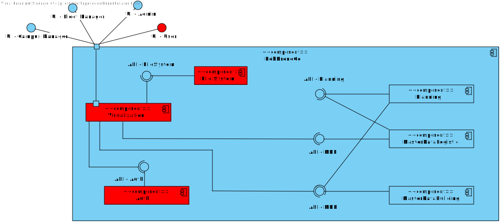
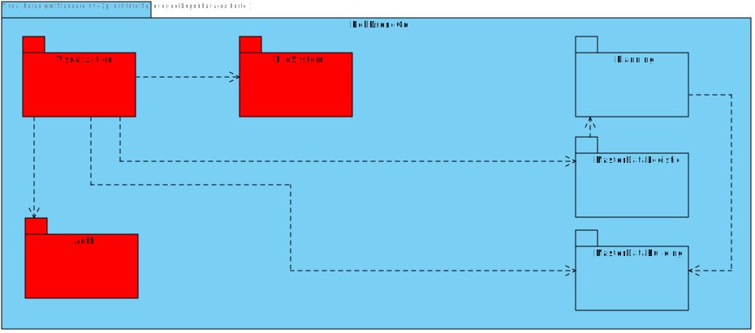
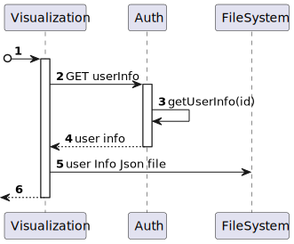
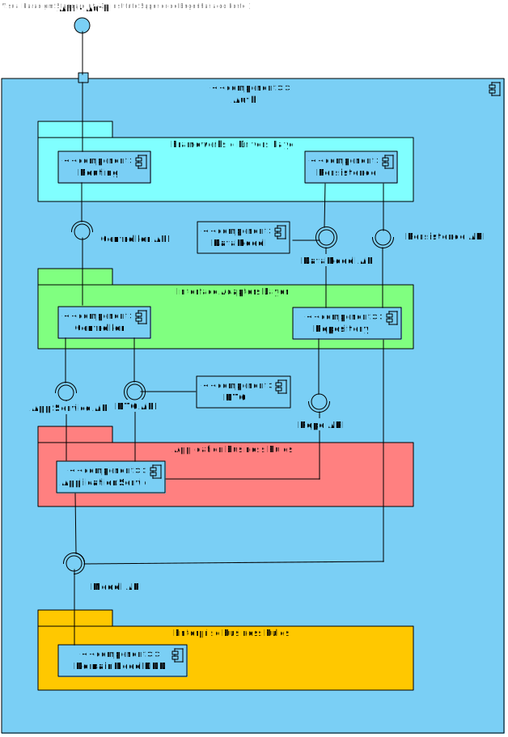
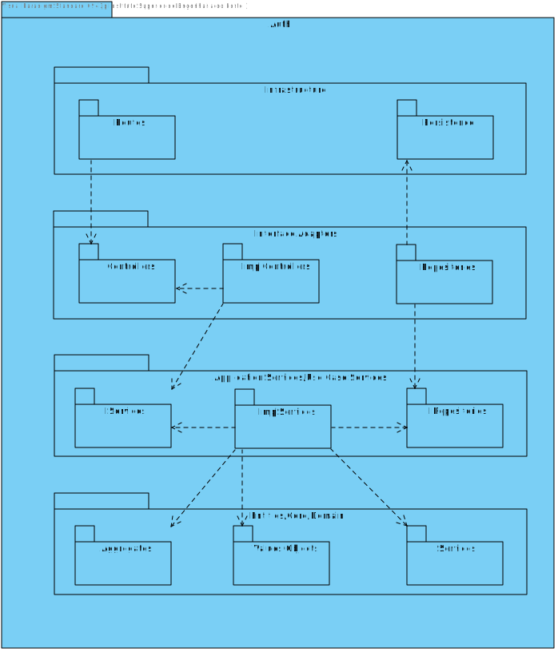
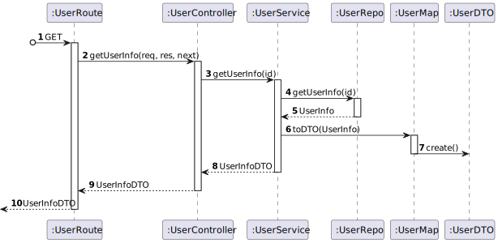
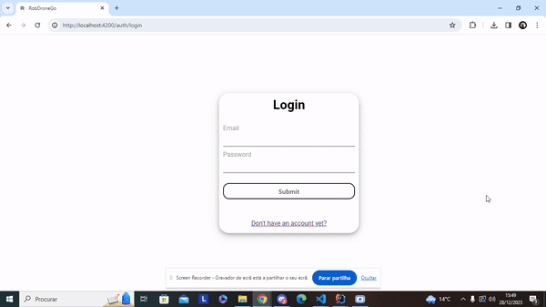

# US 110 - As a system user I intend to copy my personal data.

## 1. Context

* This is the first time this task is being developed

## 2. Requirements

**US 110 -** As a system user I intend to copy my personal data.

## 3. Analysis

### Questions to the client
> Q: como utente do sistema pretendo uma cópia dos meus dos meus dados pessoais - devemos considerar o utente como qualquer utilizador do sistema ou só mesmo os utentes (aluno, docente, funcionario)?
> <br>A: apenas os utentes

> Q: Gostaria de saber como a cópia dos dados pessoais deve ser feita.
> <br>A: deve ser gerado um ficheiro json com a informação que o sistema guardou sobre a pessoa.


**Regarding this requirement we understand that:**
As an actor of the system, I want to be able to copy my personal data.
In the process of copying my personal data the user should be able to download a json file with his/hers personal data.
The user should be able to download the file from the system by clicking a button.

## 4. Design

### 4.1. Realization

### Level1
###### LogicalView:


###### SceneryView:


###### ProcessView:


#### Level2

###### LogicalView:



###### ImplementationView:


###### PhysicalView:


###### ProcessView:


#### Level3
###### LogicalView:


###### ImplementationView:


###### ProcessView:


### 4.2. Applied Patterns
* Controller
* Service
* Dto

### 4.3. Tests

**Test 1:** **Integration test - GetUserInfo**
```
[TestMethod]
    public async Task GetUserInfo_ValidId_ReturnsUserDto()
    {
        string name = "Jose Gouveia";
        string email = "1211089@isep.ipp.pt";
        string phoneNumber = "930597721";
        string taxPayerNumber = "290088763";
        string password = "1211089aA!";
        string role = "Utente";

        var mock = new Mock<IUserService>();
        mock.Setup(m => m.GetUserInfo(It.IsAny<string>()))
            .ReturnsAsync(new UserDto(name, email, phoneNumber, taxPayerNumber, role));
        
        var result = await mock.Object.GetUserInfo(email);
        var userDto = result;
        
        Assert.IsNotNull(result);
        Assert.AreEqual(name, userDto.Name);
        Assert.AreEqual(email, userDto.Email);
        Assert.AreEqual(phoneNumber, userDto.PhoneNumber);
        Assert.AreEqual(taxPayerNumber, userDto.TaxPayerNumber);
        Assert.AreEqual(role, userDto.Role);
    }
```

**Test 2:** **Integration test - UserNotFound**
```
[TestMethod]
    public async Task GetUserInfo_UserNotFound_ThrowsBusinessRuleValidationException()
    {
        string email = "1211089@isep.ipp.pt";

        var mock = new Mock<IUserService>();
        mock.Setup(m => m.GetUserInfo(It.IsAny<string>()))
            .ThrowsAsync(new BusinessRuleValidationException("User not found"));

        try
        {
            var result = await mock.Object.GetUserInfo(email);
        }
        catch (Exception e)
        {
            Assert.IsTrue(e is BusinessRuleValidationException);
        }

    }
```

**Test 3:** **Integration test - InvalidIdFormat**
```
 [TestMethod]
    public async Task GetUserInfo_InvalidIdFormat_ThrowsException()
    {

        var mock = new Mock<IUserService>();
        mock.Setup(m => m.GetUserInfo(It.IsAny<string>()))
            .ThrowsAsync(new Exception("Invalid id format"));

        try
        {
            var result = await mock.Object.GetUserInfo("1211089isep.ipp.pt");
        }
        catch (Exception e)
        {
            Assert.IsTrue(e is Exception);
        }

    }
```

**Test 4:** **Unit Controller Test - Valid Info**
```
[TestMethod]
    public async Task GetUserInfo_ReturnsOkResult()
    {
        string name = "Jose Gouveia";
        string email = "1211089@isep.ipp.pt";
        string phoneNumber = "930597721";
        string password = "1211089aA!";
        string role = "Admin";     
        string id = email;

        var userServiceMock = new Mock<IUserService>();
        var userDto = new UserDto(name, email, phoneNumber, "999999999", "Admin");
        userServiceMock.Setup(x => x.GetUserInfo(id)).ReturnsAsync(userDto);
        var userController = new UserController(userServiceMock.Object);

        var result = await userController.GetUserInfo(id);

        Assert.IsInstanceOfType(result.Result, typeof(OkObjectResult));
        var okResult = (OkObjectResult)result.Result;
        Assert.AreEqual(userDto, okResult.Value);
    }
```

**Test 5:** **Unit Controller Test - Bad Request**
```
[TestMethod]
    public async Task GetUserInfo_ReturnsBadRequestResult()
    {
        string id = "1211089@isep.ipp.pt";
        var userServiceMock = new Mock<IUserService>();
        userServiceMock.Setup(x => x.GetUserInfo(id)).ThrowsAsync(new Exception("Some error occurred."));
        var userController = new UserController(userServiceMock.Object);

        var result = await userController.GetUserInfo(id);

        Assert.IsInstanceOfType(result.Result, typeof(BadRequestObjectResult));
        var badRequestResult = (BadRequestObjectResult)result.Result;
        Assert.AreEqual("Some error occurred.", badRequestResult.Value);
    }
```

**Test 6:** **Unit Service Test - ValidId**
```
[TestMethod]
    public async Task GetUserInfo_ValidId_ReturnsUserDto()
    {
        var userId = "utente@isep.ipp.pt";
        var user = User.Create("User", userId, "912345678", "912345678", "123456789aA!", "Utente");
        _userRepository.Setup(repo => repo.GetByIdAsync(It.IsAny<Email>())).ReturnsAsync(user);


        var result = await _userService.GetUserInfo(userId);

        Assert.IsNotNull(result);
        Assert.AreEqual(user.Name.NameString, result.Name);
        Assert.AreEqual(userId, result.Email);
        Assert.AreEqual(user.PhoneNumber.Number, result.PhoneNumber);
        Assert.AreEqual(user.TaxPayerNumber.Number, result.TaxPayerNumber);
        Assert.AreEqual(user.Role.Value, result.Role);
    }
```

**Test 7:** **Unit Service Test - InvalidId**
```
[TestMethod]
    public async Task GetUserInfo_InvalidId_ThrowsBusinessRuleValidationException()
    {
        string id = "invalid@isep.ipp.pt";
        var email = Email.Create(id);
        _userRepository.Setup(x => x.GetByIdAsync(email)).ReturnsAsync((User)null);

        await Assert.ThrowsExceptionAsync<BusinessRuleValidationException>(() => _userService.GetUserInfo(id));
    }
```

**Test 8:** **Unit Service Test - ExceptionThrown**
```
[TestMethod]
    public async Task GetUserInfo_ExceptionThrown_ThrowsException()
    {
        string id = "invag@isep.ipp.pt";
        var email = Email.Create(id);
        _userRepository.Setup(x => x.GetByIdAsync(email)).ThrowsAsync(new Exception("Some error occurred"));

        await Assert.ThrowsExceptionAsync<Exception>(() => _userService.GetUserInfo(id));
    }
```


## 5. Implementation

#### UserController
```
[HttpGet("{id}")]
        public async Task<ActionResult<UserDto>> GetUserInfo(string id){
            try
            {
                var user = await this._userService.GetUserInfo(id);
                return Ok(user);
            }
            catch (Exception e)
            {
                return BadRequest(e.Message);
            }
        }
```

#### UserService
```
public async Task<UserDto> GetUserInfo(string id){
            try
            {
                _logger.LogInformation("UserService: Getting current user\n\n");

                var email = Email.Create(id);
                var user = await this._userRepository.GetByIdAsync(email);
                if (user == null)
                {
                    throw new BusinessRuleValidationException("User not found");
                }
                return new UserDto(user.Name.NameString, user.Id.Value, user.PhoneNumber.Number, user.TaxPayerNumber.Number, user.Role.Value);
            }
            catch (BusinessRuleValidationException e)
            {
                _logger.LogWarning("UserService: Error has occurred while getting current user: " + e.Message + "\n\n");
                throw new BusinessRuleValidationException(e.Message);
            }
            catch (Exception e)
            {
                _logger.LogError("UserService: Error has occurred while getting current user: " + e.Message + "\n\n");
                throw new Exception(e.Message);
            }
        }
```

## 6. Integration/Demonstration


## 7. Observations
