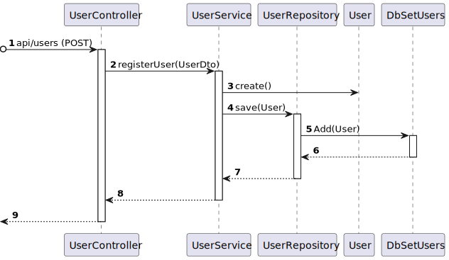

# US 20 - Como potencial utente do sistema (ex., aluno, docente) pretendo registar-me como utente do sistema

## 1. Context

* 


## 2. Requirements

**US 20 -** Como potencial utente do sistema (ex., aluno, docente) pretendo registar-me como utente do sistema

## 3. Analysis

**Regarding this requirement we understand that:**


### 3.1. Domain Model Excerpt

## 4. Design

### 4.1. Realization

### Level1

###### LogicalView:


###### SceneryView:


###### ProcessView:


#### Level2

###### LogicalView:


###### ImplementationView:


###### PhysicalView:


###### ProcessView:


#### Level3

###### LogicalView:


###### ImplementationView:


###### ProcessView:




### 4.2. Applied Patterns


### 4.3. Tests

```ts

```


## 5. Implementation

## 6. Integration/Demonstration

## 7. Observations

No additional observations.
